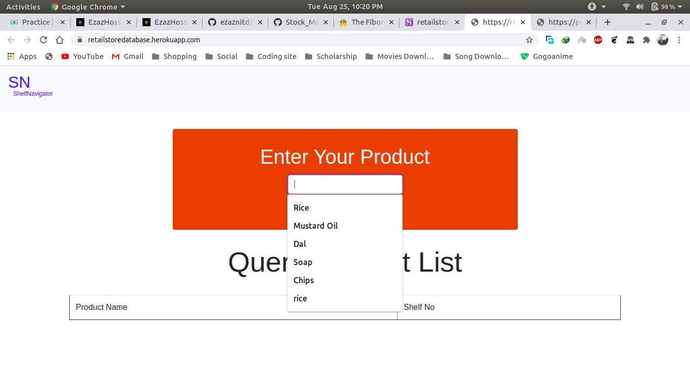

# Retail Shop Management System:
Build a solution to help the customers find products in the store and help them to navigate to the corresponding aisle /shelf. If there is a shopping list, provide the best shopping trip to complete the purchases.

## Solution Approach:
I have developed a navigation system that suggests the customer the best possible way to get the items in his list in  a shopping mall.
	Generally customers come with a shopping list in the stores. When customer have a large list of products and the  grocery shop is too large to search for a particular product then we will navigate customers to the proper shelf.  We will store details of every product in the shop’s dataset. On the basis of customer query our model will tell the customer about the availability of the product and shelf number where it is present.
	When the customer will be done with his/her list, we will finally show a list consisting of all the items available in the shop at that moment.

## Technology/Tool/Cloud Stack:
On the basis of customer’s query our model will show availability of different types of the product and the corresponding shelf number the product.
In our model we have used ‘FLASK’ to interact our model with web browser and ‘SQLALCHEMY’ for update our database and make query in our database on the basis of search engine.

### Installation Process:
Run 'pip3 install -r requirements.txt' in your terminal to install all the dependencies for the project.

### How to run the model?:
After installation of 'requirements.txt' run 'python3 myapp.py' to initialize the model.

### Some overview of my Retail Shop Management system application:

# Usage:
My Retail Shop Management system application is currently deployed on Heroku. The website can be accessed through https://retailstoredatabase.herokuapp.com/
